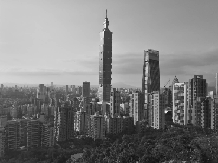
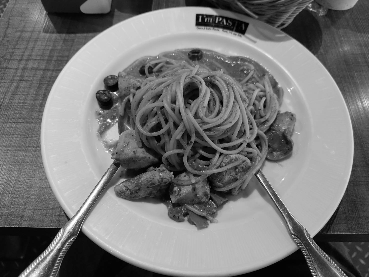
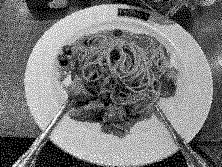
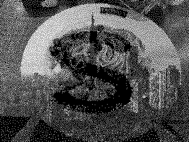

# HVC-VAC-method

Final project for Digital Image Processing in Fall 2022 in National Taiwan University
An implementation of void-and-cluster algorithm for halftone visual cryptography.

## How to Use
Consult `python main.py -h`.

```
$ python main.py -h
usage: main.py [-h] --input INPUT INPUT --secret SECRET --output OUTPUT OUTPUT

   VAC-based Halftoned Visual Cryptography (HVC-VAC)
   
   Given 2 (grayscale) images and 1 secret binary image,
   generate 2 binary images s.t. if you binary-AND those 2 images,
   you can see the secret image.
   
   All 3 input images should be the same size.

options:
  -h, --help            show this help message and exit
  --input INPUT INPUT, -i INPUT INPUT
                        Greyscale images to be halftoned
  --secret SECRET, -s SECRET
                        Binary secret image to be embedded
  --output OUTPUT OUTPUT, -o OUTPUT OUTPUT
                        Binary output image path, should be 2 different path
```

## Sample result
```
python main.py -i imgs/test/testimg_a.png imgs/test/testimg_b.png -s imgs/test/testimg_sec.png -o imgs/test/testimg_res_a.png imgs/test/testimg_res_b.png
```




## Reference
E. Myodo, S. Sakazawa and Y. Takishima, "Visual Cryptography Based on Void-And-Cluster Halftoning Technique," 2006 International Conference on Image Processing, 2006, pp. 97-100, doi: 10.1109/ICIP.2006.312371.

R. A. Ulichney, "The void-and-cluster method for dither array
generation", Proc. SPIE, Human Vision Visual Processing, Digital
Displays IV, Vol. 1913, pp. 332-343, 1993.