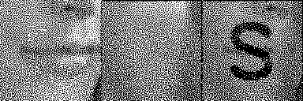

# HVC-VAC-method

Final project for Digital Image Processing in Fall 2022 in National Taiwan University
An implementation of void-and-cluster algorithm for halftone visual cryptography.

## How to Use
Consult `python main.py -h`.
If you want actual code / command, refer to `example/test/RUN.sh`. Make sure to run that in `example/test/RUN.sh`. Same goes to `example/test_color/RUN.sh`.

```
$ python main.py -h
usage: main.py [-h] [--input INPUT INPUT] [--output OUTPUT OUTPUT] [--save_model SAVE_MODEL] [--and_result AND_RESULT] [--color]
               (--secret SECRET | --load_model LOAD_MODEL)

   VAC-based Halftoned Visual Cryptography (HVC-VAC)

   Given 2 (grayscale) images and 1 secret binary image,
   generate 2 binary images s.t. if you bitwise-AND those 2 images,
   you can see the secret image.
   All 3 input images should be the same size.

   Or if you just want to save the VAC result (i.e. the thresholding arrays and stuff),
   you can choose to save the pickled model, so that you can skip the lengthy VAC part and
   do thresholding directly on your images later on, by loading back the model.
   (The thresholding part is very fast, the time is mostly spent on making the thresholding arrays)

   Refer to examples (in folder `example/`) if you need more examples on how to use this.

options:
  -h, --help            show this help message and exit
  --input INPUT INPUT, -i INPUT INPUT
                        2 grayscale images to be halftoned
  --output OUTPUT OUTPUT, -o OUTPUT OUTPUT
                        2 binary output image path, should be 2 different path
  --save_model SAVE_MODEL, -m SAVE_MODEL
                        Save the pickled model into some destination for further usage.
                        The pickled model is dependent to the secret image, but not input image
  --and_result AND_RESULT, -a AND_RESULT
                        Save the bitwise-AND result into the designated path
  --color, -c           Do color version HVC, default grayscale.
  --secret SECRET, -s SECRET
                        Binary secret image to be embedded
  --load_model LOAD_MODEL, -l LOAD_MODEL
                        Load the pickled model
```

## Sample result
```
python main.py -i example/test/img_a.png example/test/img_b.png -s example/test/img_sec.png -o example/test/img_res_a.png example/test/img_res_b.png
```



```
python main.py -c -i example/test_color/img_a.png example/test_color/img_b.png -s example/test_color/img_sec.png -o example/test_color/img_res_a.png example/test_color/img_res_b.png
```


## Reference
E. Myodo, S. Sakazawa and Y. Takishima, "Visual Cryptography Based on Void-And-Cluster Halftoning Technique," 2006 International Conference on Image Processing, 2006, pp. 97-100, doi: 10.1109/ICIP.2006.312371.

R. A. Ulichney, "The void-and-cluster method for dither array
generation", Proc. SPIE, Human Vision Visual Processing, Digital
Displays IV, Vol. 1913, pp. 332-343, 1993.